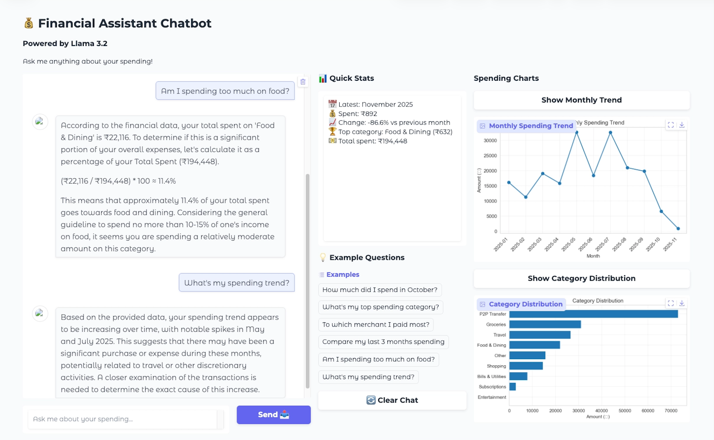

# AI Financial Assistant

Offline AI financial assistant that converts raw bank statements into structured analytics and grounded conversational insights.

Built to explore applied LLM grounding over real-world financial data pipelines.

---

## Why This Project Matters

Financial AI systems are prone to hallucinating numerical insights.

This prototype explores a hybrid architecture where:

- All numerical computations are done deterministically using pandas
- The LLM is used only for reasoning and explanation
- Responses are grounded strictly on precomputed analytics
- No financial calculations are performed by the LLM

The goal was to design a system that combines structured data processing with LLM reasoning in a reliable way.

---

## What This Prototype Demonstrates

- PDF → structured data pipeline
- Transaction cleaning and normalization using pandas
- Hybrid merchant categorization:
  - Rule-based mapping for common merchants
  - LLM-assisted reasoning (Llama 3.2 via Ollama) for edge cases
- Precomputed analytics grounding (no hallucinated numbers)
- Local-first architecture for privacy
- Conversational Q&A over structured financial data
- Interactive visualizations using Gradio

---

## Architecture

```

PDF Input
↓
Tabula Extraction → CSV
↓
Pandas Cleaning & Normalization
↓
Merchant Categorization (Rule-Based + LLM)
↓
Analytics Computation (Deterministic)
↓
Gradio Interface (Chat + Charts)

```

---

## Key Design Decisions

- Hybrid categorization system instead of pure LLM classification
- Deterministic financial calculations (LLM never performs math)
- Precomputed metrics used to ground all responses
- Local LLM execution via Ollama for privacy
- Separation between data processing layer and reasoning layer

---

## Tech Stack

- Python
- pandas
- Tabula (PDF table extraction)
- Ollama (Llama 3.2 local inference)
- Gradio
- Matplotlib / Plotly

---

## Project Structure

- `AI_Financial_Assistant_Prototype.ipynb`  
  Main notebook containing the complete pipeline: parsing, cleaning, categorization, analytics, and Gradio interface.

- `financial_assistant_clean.ipynb`  
  Clean version of the notebook without executed outputs.

- `Screenshot.png`  
  UI preview of the financial assistant interface.

- `README.md`  
  Project documentation and architecture overview.

---

## Setup Instructions

1. Install Ollama  
2. Pull the Llama model:
```

ollama pull llama3.2

```
3. Install dependencies:
```

pip install -r requirements.txt

```
4. Run the notebook:
```

jupyter notebook AI_Financial_Assistant_Prototype.ipynb

```

---

## Scope & Limitations

- Currently tested on ICICI-style bank statements
- Extending to other banks would require format adapters
- Built as an applied AI prototype to explore reliable LLM grounding over financial data
- Not intended as production-ready fintech software

---

## Demo



